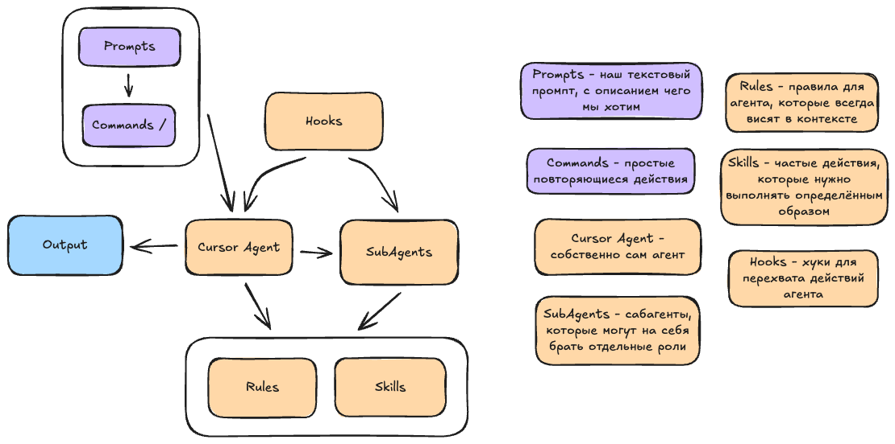

# .cursor — AI Configuration



This folder contains all Cursor AI configuration for the project: rules, slash commands, and background agents.

---

## Structure

```
.cursor/
├── rules/
│   └── general.mdc          # Always-applied coding standards and AI behavior
├── commands/
│   ├── code-review.md        # Deep code review with severity ratings
│   ├── write-tests.md        # Generate tests for selected code
│   ├── explain.md            # Explain code in plain language
│   ├── security-review.md    # Security audit
│   ├── optimize-performance.md
│   ├── add-documentation.md
│   └── run-all-tests-and-fix.md
├── agents/
│   ├── worker.md             # Code implementation specialist
│   └── test-runner.mdc       # Autonomous test runner and fixer
└── hooks.json                # Event hooks
```

---

## rules/

Rules are injected into every AI conversation automatically (`alwaysApply: true`).

- **`general.mdc`** — defines tech stack (FastAPI, React, PostgreSQL), code style, error handling policy, security rules, and AI interaction preferences.

---

## commands/

Slash commands triggered manually in chat (e.g. `/code-review`). Each command gives the AI a focused role and a structured output format.

| Command | Purpose |
|---|---|
| `code-review` | Audit code for bugs, design issues, and security risks |
| `write-tests` | Generate unit/integration tests for selected code |
| `explain` | Plain-language explanation of selected code |
| `security-review` | Check for vulnerabilities and unsafe patterns |
| `optimize-performance` | Profile and suggest performance improvements |
| `add-documentation` | Add docstrings and inline comments |
| `run-all-tests-and-fix` | Run the full test suite and fix failures |

---

## agents/

Background agents that can be delegated full sub-tasks.

- **`worker`** — implementation specialist. Writes code, creates components, follows architecture principles. Called by the planner when a subtask needs coding work.
- **`test-runner`** — autonomous test runner. Discovers tests, executes them, and iterates on fixes until the full suite passes.
